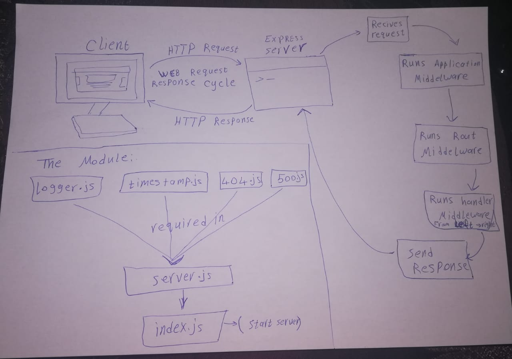

# LAB - Class 07

## Project: api-server

### Author: Esra'a Mamoun

### Links and Resources

- [submission PR](https://github.com/EsraaMamoun-401-advanced-javascript/api-server2/pull/1)
- [ci/cd](https://github.com/EsraaMamoun-401-advanced-javascript/api-server2/actions) (GitHub Actions)
<!-- - [back-end server url](http://xyz.com) (when applicable) -->
<!-- - [front-end application](http://xyz.com) (when applicable) -->

### Setup

#### `.env` 

- `PORT` - PORT=3000

### Modules
- server.js
- logger.js
- timestamp.js
- 404.js
- 500.js
- products-collection.js
- products-schema.js
- categories.collection.js
- categories-schema.js
- model.js
- categories.js
- product.js

### Packages
- supertest
- mongoose
- express
- morgan
- jest

#### How to initialize/run your application (where applicable)

- `node index.js`
- `npm run start-dev`

<!-- #### How to use your library (where applicable)
- Lint Tests: `npm run lint` -->

#### Tests

* How do you run tests?
 > - Jest test: `npm test` - to run the test for two files 
 > - console.log
<!-- - Any tests of note?
- Describe any tests that you did not complete, skipped, etc -->

#### UML

